# Retrieval-Augmented Generation (RAG) Chatbot PoC using Amazon Bedrock SDK (powered by Knowledge bases & Agents)
## Sample QA Chatbot

This project provides a step-by-step guide to create Amazon Bedrock Knowledge Bases and Agents with a Pinecone Vector database using `boto3`along with a sample Streamlit QA chatbot.

## Table of Contents
1. [Project Overview](#project-overview)
2. [Prerequisites](#prerequisites)
3. [Solution Overview](#solution-overview)
4. [Setup](#setup)
   - [Pinecone Configuration](#pinecone-configuration)
5. [Deployment](#deployment)
   - [Create Bedrock Components](#create-bedrock-components)
   - [Run the Sample QA Chatbot](#run-the-sample-qa-chatbot)
6. [Sample Prompts](#sample-prompts)
7. [Cleanup](#cleanup)
8. [Future Enhancements](#future-enhancements)

## Project Overview
This project demonstrates the creation of Amazon Bedrock Knowledge Bases and Agents, and their integration with a Pinecone Vector database using boto3 SDK. The project includes a generic Boto3 implementation of Amazon Bedrock Knowledgebases and Agents, as well as an OpenAPI schema with a reset function. These are provided as samples to help you get started.

## Prerequisites
- **AWS Account**: You will need an AWS account with the necessary permissions to create and manage Bedrock Knowledge Bases, Agents, and associated resources.
- **Python 3**: The project uses Python 3, so you'll need to have it installed on your system.
- **Boto3**: The project uses the Boto3 library to interact with AWS services. You'll need to install it using `pip install boto3`.
- **Pinecone**: You'll need to create a free Pinecone account and an index to store your vector data.
- **Streamlit**: The project uses Streamlit to build the QA chatbot. You'll need to install it using `pip install streamlit`.

## Solution Overview

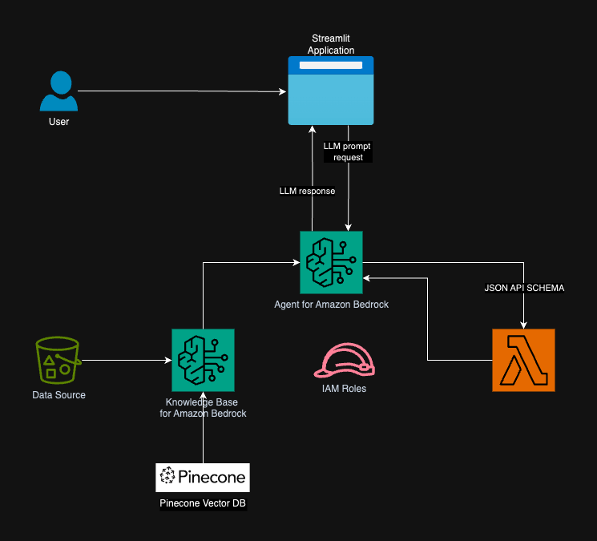

The diagram details a high-level view on how Sample chatbot responds to user queries. Queries made through the user interface (Streamlit application) interfaces with Amazon Bedrock Agent. This agent responds to user inquiries by either consulting the knowledge base or by invoking an Agent Executor Lambda function. This function invokes a set of actions associated with the agent, following a predefined API schema. The knowledge base uses a Pinecone vector store as its vector database foundation.

## Setup

### Pinecone Configuration
1. Go to [pinecone.io](https://www.pinecone.io/) and sign up for a free account if you don't have one already.

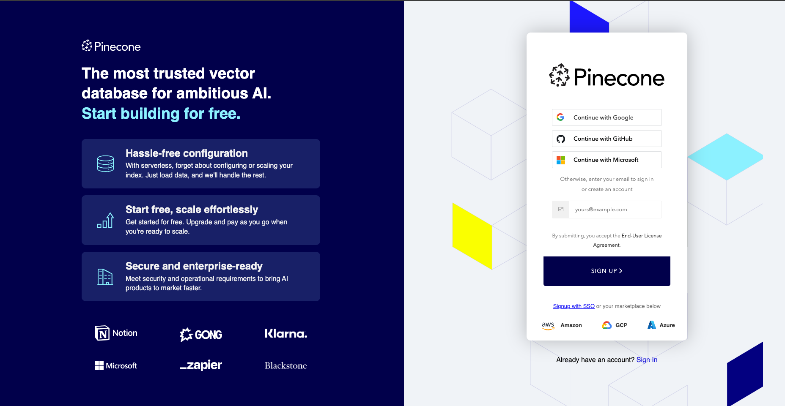

2. Once logged in, click on the "INDEXES" menu on the left-hand side and create a new index. Name the index `datafield` and select the appropriate model dimensions (e.g., 1024).

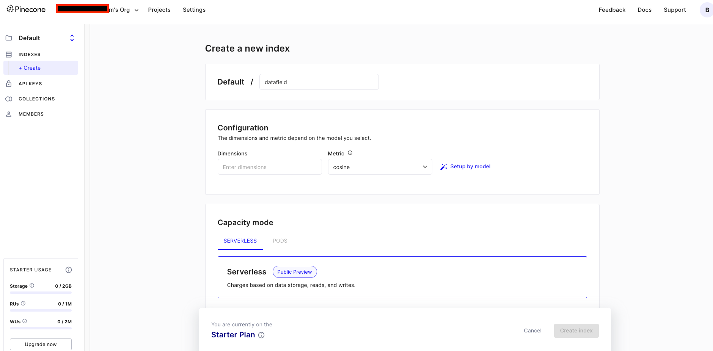</br>
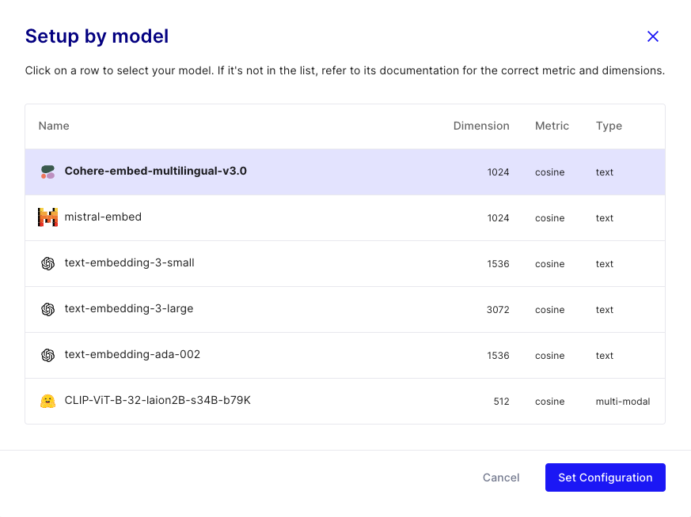

3. Click on the "API KEYS" menu and copy the API key. This will be used in the next step.

4. Pinecone config summary:
- Index Name = `datafield`
- Pinecone connection URL [e.g. `https://datafield-xxxx.svc.gcp-starter.pinecone.io`]

5. Create Secrets Manager with key = `apiKey`  
   Follow below steps to create AWS Secrets Manager. Copy API Key and store it in secrets manager 

   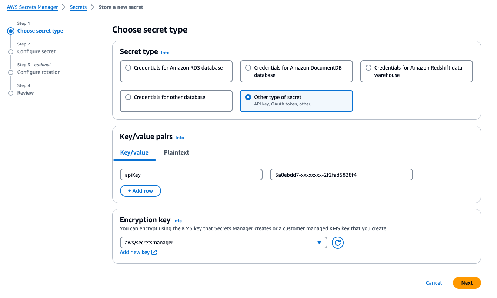</br>

   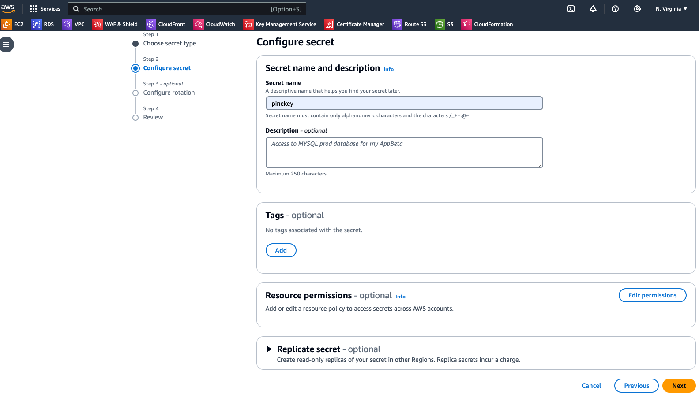</br>

   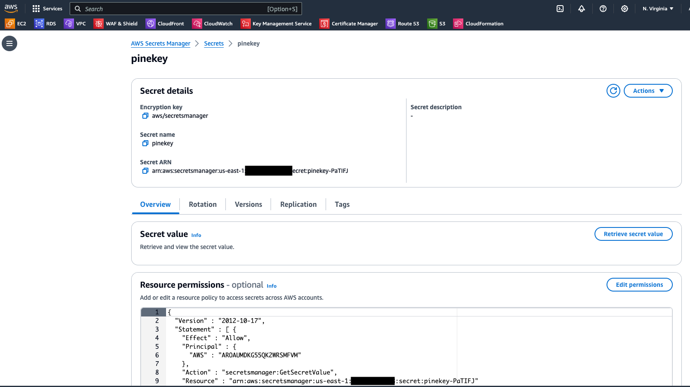</br>
   
   Copy the Secrets Manager ARN

## Deployment

### Create Amazon Bedrock Components using boto3 [Backend]
1. Clone the repository
   ```
   git clone git@github.com:aws-samples/genai-chatbot-using-bedrock-agents-poc.git
   ```
2. For this sample, we are using Amazon Bedrock user guide available online  
   >
      `upload_file_url` variable in line # 17 of `create_kb.py` file

3. Update below values in `create_kb.py` script
   >
         line # 35 - `kb_pinecone_conn` - Pinecone connection URL from step 4 above
         line # 36 - `pinecone_key_sm_arn` - Secrets Manager ARN created in step 5 above
   
4. Navigate to the `src/deploy` directory in your project.
   ```
   cd genai-chatbot-using-bedrock-agents-poc/src/deploy
   ```
5. Run the `create_bedrock_components.py` script to create the Bedrock Knowledge Base, Agent, and associated resources.
   ```
   python create_bedrock_components.py
   ```
6. This script will set up the entire stack, including the necessary roles, S3 buckets, OpenAI schema, and Lambda function. If you need to update the reference document or add additionals documents to knowledge base, you can do so by uploading a new PDF file to the `documents` folder in the `src`. Cleanup and re-run the deployment script.

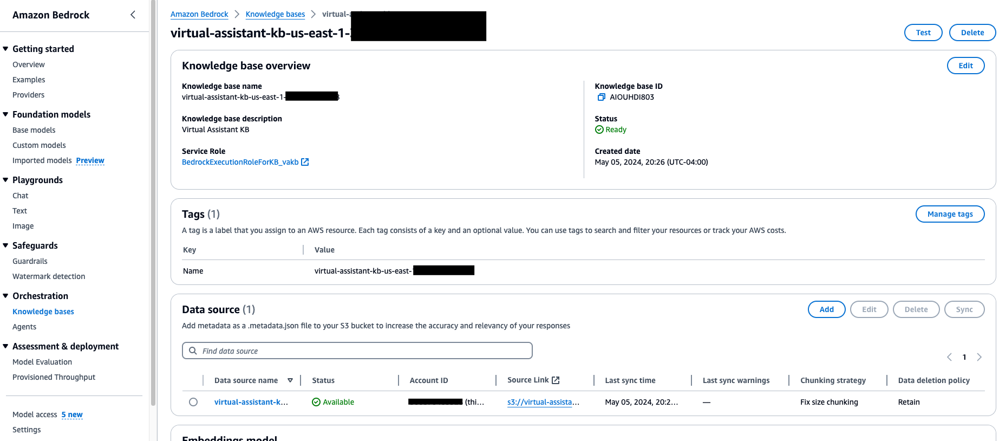</br>

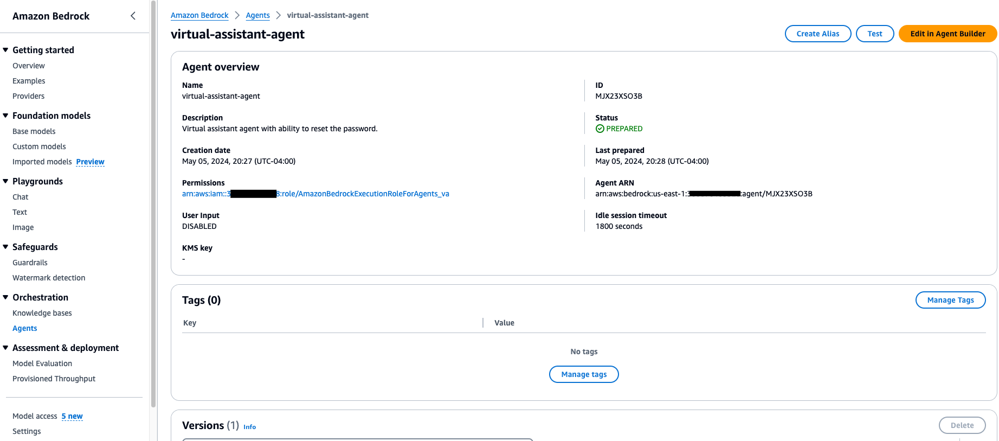</br>

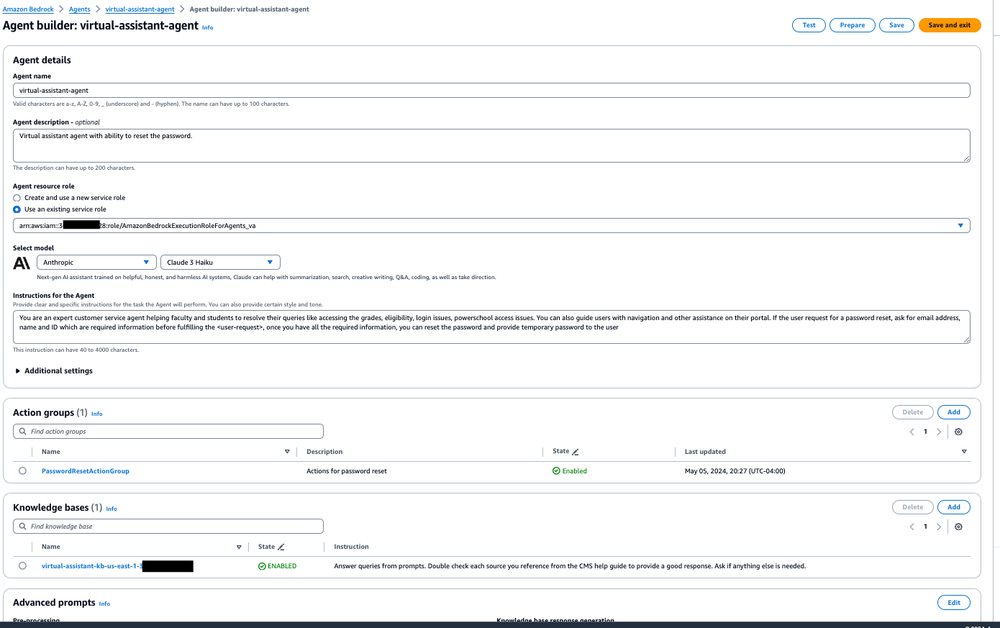</br>

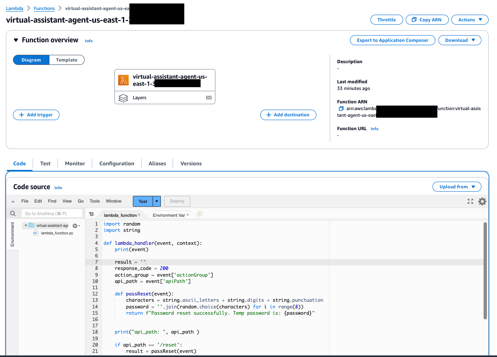


### Run the Sample QA Chatbot [FrontEnd]
1. Navigate to the `src/app` directory in your project.
   ```
   cd genai-chatbot-using-bedrock-agents-poc/src/app
   ```
2. Run the `main.py` script to start the Streamlit QA chatbot.
   ```
   streamlit run main.py
   ```
3. This will launch the Sample QA chatbot, which you can use to interact with the Bedrock Knowledge Base and Pinecone Vector database.

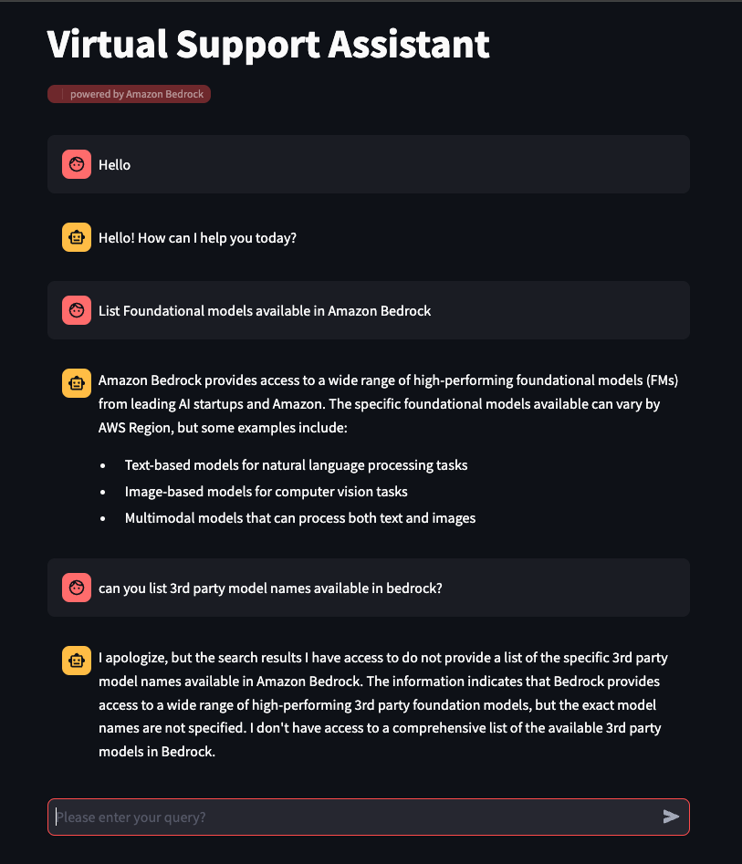

## Sample Prompts
Here are some sample prompts you can use to interact with the Sample QA chatbot:
- List Foundational models available in Amazon Bedrock
- Can you explain Bedrock pricing model
> Below prompt is just to test the agent invoking the action group. Not linked to the document in the Knowledge base
- Can you help me with password reset?

## Cleanup
1. Get the `Agent ID` and `Knowledge Base ID` created from the console.

2. Update below variables in `cleanup_all.py` file in the `src/deploy` directory
>
      line # 11 - `agentid` - Agend ID
      line # 12 - `knowledge_base_id` - Knowledge base ID
   
3. Run the `cleanup_all.py` script to delete the Bedrock components and associated resources.
   ```
   cd genai-chatbot-using-bedrock-agents-poc/src/deploy
   
   python cleanup_all.py
   ```

## Future enhancements
1. Add CDK deployment feature
2. Update Frontend components to support HA
3. Remove hardcoded IDs and run using configs
4. Add additional actions for agents in the API schema
5. Update to support latest features in Knowledgebases and agents
